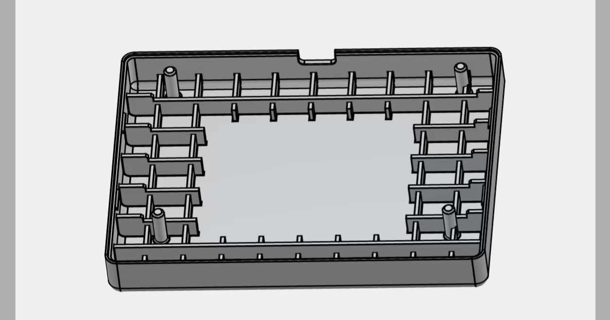
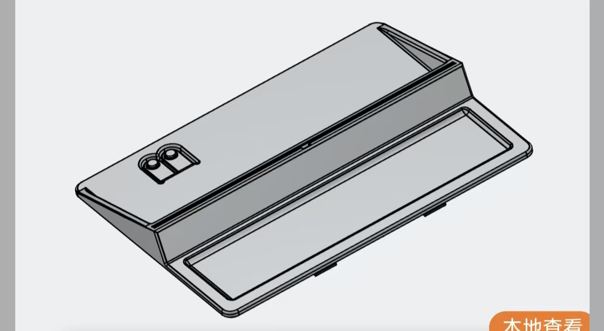

# 四色墨水屏桌面信息终端

基于 STM32G070CBT6 与 4.2 英寸 400 × 300 四色墨水屏的桌面终端。设备通过 NFC 识别与配对，通过 BLE 接收手机或电脑制作的画面；也可以显示带本地时钟和环境信息的日历，并用七颗 LED 呈现灯效。仓库提供设备固件、Bootloader、硬件资料、3D 外壳模型及客户端对接文档。

> 本仓库目前主要是设备端工程和协议资料。Android 与 Windows 应用的源码、安装包及各自的构建说明未包含在当前仓库中；下文“二次开发”列出的是开发这两端应用时需要阅读的设备协议与需求文档。部分文档保留早期设计草案和历史验证记录，遇到不一致时请结合当前固件接口核对。




## 能做什么

- **四色图片显示**：客户端将照片裁剪并缩放到 400 × 300，量化为黑、白、黄、红四种颜色，编码为 30,000 字节的 2bpp 画面，经 BLE 分包发送；设备完成校验后刷新。墨水屏断电仍能保持最后画面。
- **NFC 配对与 BLE 通信**：手机通过 ST25DV04K 的 NDEF 信息取得设备身份与配对凭据，再连接 CH9140；图片、控制命令和升级数据经 BLE 传送，NFC 不承担图片传输。
- **日历与温湿度**：客户端制作日历底图，STM32 使用 RTC 和 AHT20 叠加日期、今日高亮及室内温度；保存的底图支持设备在跨日后本地重绘。Android 日历方案还包含系统日历事件、手机定位与室外天气。
- **七灯效果**：74HC595 驱动七颗 LED，提供关闭、湿度呼吸、由中心向两侧展开的扩散呼吸三种模式；NFC 感应时临时显示同步呼吸。按键和经过认证的 BLE 命令可选择背景模式。
- **BLE 固件升级**：Bootloader 接收 .epota 升级包，校验后更新 Application；中断升级时可以重新进入恢复传输流程。
- **电脑串口灯效**：设备经 CH340 的 USART1 接收 Pulse v1 控制协议，可将电脑端的负载数据映射为 LED 效果。该路径与通过 CH9140 使用 BLE 发送画面的路径不同。

## 硬件与通信

| 模块 | 用途 |
| --- | --- |
| STM32G070CBT6 | 固件运行、墨水屏刷新、RTC、协议处理和灯效控制 |
| GDEM042F86，400 × 300 四色墨水屏 | 图片与日历显示 |
| ST25DV04K | NFC 近场识别与配对信息 |
| CH9140 | BLE 透明串口，连接 MCU 的 USART2 |
| AHT20 | 室内温湿度采样 |
| 74HC595、七颗 LED | 氛围灯输出 |
| CH340 | 电脑与 MCU 的 USART1 串口通信 |

具体接线请看 [电路图](refer_doc/SCH_Schematic3_2026-09-11.pdf) 与 [CubeMX 配置](refer_doc/墨水屏项目.ioc)。三维模型和预览图位于 [3dmodels](3d外壳)；立创 EDA 工程位于 [pcbproject](pcbproject)。

## 仓库导航

```text
Core/          STM32 Application：屏幕、传图、RTC、日历、传感器、灯效和串口协议
Bootloader/    BLE OTA Bootloader
Drivers/       STM32 HAL / CMSIS 依赖
files/         硬件、Android 需求和设备通信协议文档
docs/          Windows 固件构建说明及 Pulse 开发记录
3d外壳/        外壳 STEP 模型、Blender 文件与预览图
pcbproject/    PCB 工程
tools/         OTA 打包等辅助工具
tests/         设备端协议和灯效测试
```

## 二次开发：先读哪些文档

### Android 应用

建议按以下顺序阅读。文档路径均在 files/ 内：

1. [ANDROID_APP_REQUIREMENTS.md](refer_doc/ANDROID_APP_REQUIREMENTS.md)：应用流程、NFC 唤起、BLE GATT、认证、图片处理、传输状态与错误处理的总入口。
2. [IMAGE_TRANSFER_PROTOCOL.md](refer_doc/IMAGE_TRANSFER_PROTOCOL.md)：NDEF 格式、BLE 帧、HELLO/认证、2bpp 数据、分包 ACK、CRC/HMAC 和状态码。客户端与固件联调以此为基础。
3. [ANDROID_CALENDAR_DEVELOPMENT.md](refer_doc/ANDROID_CALENDAR_DEVELOPMENT.md)：若开发日历功能，阅读日历底图与 MCU 叠加层的分工、系统日历、天气、时间同步和画布坐标。文档含早期草案描述，实际支持情况还需与当前固件核对。
4. [ANDROID_LED_CONTROL.md](refer_doc/ANDROID_LED_CONTROL.md)：若开发七灯控制或动画预览，阅读三种模式、颜色、BLE 命令与 NFC 临时效果的优先级。
5. [BLE_OTA_DESIGN.md](refer_doc/BLE_OTA_DESIGN.md)：若开发手机端固件升级，阅读进入 Bootloader、重新连接、.epota 包结构、升级分片和恢复流程。

### Windows / 电脑端应用

电脑端涉及两条通信路径，先确定要开发哪一项：

| 功能 | files/ 中应读的文档 | 还应核对 |
| --- | --- | --- |
| BLE 传图与设备控制 | [IMAGE_TRANSFER_PROTOCOL.md](refer_doc/IMAGE_TRANSFER_PROTOCOL.md)；日历功能参考 [ANDROID_CALENDAR_DEVELOPMENT.md](refer_doc/ANDROID_CALENDAR_DEVELOPMENT.md)，灯效参考 [ANDROID_LED_CONTROL.md](refer_doc/ANDROID_LED_CONTROL.md) | Android 专属的 NFC 唤起、系统日历、定位和权限部分需要替换为 Windows 实现；电脑端同样要满足设备认证与报文格式 |
| BLE 固件升级 | [BLE_OTA_DESIGN.md](refer_doc/BLE_OTA_DESIGN.md) 和 [IMAGE_TRANSFER_PROTOCOL.md](refer_doc/IMAGE_TRANSFER_PROTOCOL.md) | BLE 断开重连、升级清单与 ACK/状态处理 |
| CH340 串口 Pulse 灯效 | files/ 内无独立的 Pulse 协议文档；LED 背景逻辑可读 [LED_LOGIC.md](refer_doc/LED_LOGIC.md) | [MCU_BUILD_WINDOWS.md](refer_doc/MCU_BUILD_WINDOWS.md)、[Pulse Windows 设计记录](refer_doc/superpowers/plans/2026-09-16-pulse-windows.md)、`Core/Inc/pulse_protocol.h`、`Core/Src/pulse_protocol.c`、`Core/Src/pulse_uart.c` |

### 设备固件、硬件与外壳

- 修改设备端协议或屏幕驱动：先读 [图片传输协议](refer_doc/IMAGE_TRANSFER_PROTOCOL.md)，再看 `Core/Src/image_transfer.c`、`Core/Src/gdem042f86.c`。
- 修改 OTA：先读 [OTA 设计]（refer_doc/BLE_OTA_DESIGN.md)，再看 `Bootloader/` 和 `tools/package_ota.py`。
- 修改灯效、按键或传感器：阅读 [LED_LOGIC.md](refer_doc/LED_LOGIC.md) 和 [ANDROID_LED_CONTROL.md](files/ANDROID_LED_CONTROL.md)，再看 `Core/Src/led_595.c`、`Core/Src/aht20.c`。
- 修改硬件与外壳：参考 [原理图](refer_doc/SCH_Schematic3_2026-09-11.pdf)、[IOC](files/墨水屏项目.ioc)、[PCB 工程](pcbproject) 和 [外壳模型](3d外壳)。[HARDWARE_2026_09_11.md](refer_doc/HARDWARE_2026_09_11.md) 是历史适配记录，其中早期同步呼吸演示已由当前三模式逻辑替代。

## 编译与烧录设备固件

在具备 Arm GNU Toolchain 与 Make 的环境中，从仓库根目录编译：

```bash
make -j4 firmware
```

Windows PowerShell 可使用仓库内脚本；工具链安装与定位方法见 [Windows 构建说明](refer_doc/MCU_BUILD_WINDOWS.md)：

```powershell
powershell -NoProfile -ExecutionPolicy Bypass -File .\build-mcu.ps1
```

| 组件 | 输出 HEX | BIN 烧录起始地址 |
| --- | --- | --- |
| Bootloader | `build_bootloader/epaper_bootloader.hex` | `0x08000000` |
| Application | `build/epaper_project.hex` | `0x08006000` |

HEX 自带目标地址；首次在空白芯片上使用时需分别写入 Bootloader 和 Application。Application 的 BIN 不能烧到 `0x08000000`。已有设备更新前请先阅读 [OTA 布局与恢复说明](refer_doc/BLE_OTA_DESIGN.md)，避免误擦 Bootloader、日历底图或 OTA 元数据。

## 协议与数据提示

- BLE 传图使用 `FFF0` 服务、`FFF1` Notify、`FFF2` Write；底层串口为 115200、8N1。图片画面固定 400 × 300、2bpp、30,000 字节；图片传输需要逐块确认并在校验完成后等待屏幕刷新。
- NFC 配对数据包含设备标识与密钥信息。不要在日志、演示截图或 issue 中公开真实设备的配对凭据。
- 仓库中的 OTA 发布密钥仅供开发测试；若用于实际交付设备，应替换并妥善保管发布凭据。具体限制见 [OTA 安全边界](refer_doc/BLE_OTA_DESIGN.md)。

