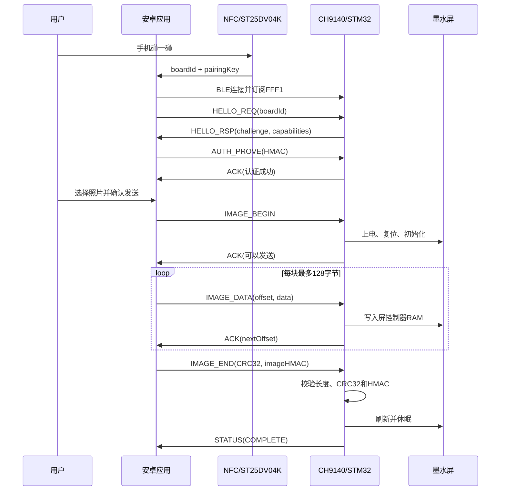

# 安卓端应用需求说明

版本：1.3

对应嵌入式协议：`IMAGE_TRANSFER_PROTOCOL.md` v1，BLE OTA v2
目标设备：STM32G070CBT6 + CH9140 + ST25DV04K + 400×300 四色墨水屏

## 2026-09-14 灯光功能增补

设备页增加“关闭 / 湿度呼吸 / 扩散呼吸”三种模式控制，以及完整七灯彩色动画预览。
控制协议、NFC 优先级、中心展开时序、颜色、动画公式和验收要求统一见 [安卓三模式灯效控制与动画规范](ANDROID_LED_CONTROL.md)。
扩散呼吸是 Q4 → Q3/Q5 → Q2/Q6 → Q1/Q7 渐亮展开，全亮保持 1 秒后同步渐暗熄灭并循环；NFC 临时效果仍为全部七灯同步呼吸。
现有“视频、动画不在范围”仅指墨水屏内容，不排除本次新增的 App 灯效预览。

## 1. 目标与范围

安卓应用完成以下闭环：

1. 用户用手机触碰设备 NFC 天线。
2. 系统通过 MIME NDEF 唤起已预装的应用。
3. 应用读取并校验设备 ID 与临时使用的配对密钥。
4. 应用扫描并连接附近唯一的 CH9140 BLE 设备。
5. 应用与 STM32 完成 challenge-response 安全验证。
6. 用户选择一张照片，应用将其裁剪成铺满屏幕的 400×300 图像。
7. 应用把图像量化为黑、白、黄、红四色并编码成 30,000 字节。
8. 应用分包传输图片，显示准备、发送、刷新和完成状态。

NFC 只负责识别目标设备并取得首次配对凭据，不通过 NFC 传输照片。照片只通过 BLE 发送。安卓端不要求支持多设备列表、设备分组或后台自动连接。

## 2. 建议技术基线

- Kotlin。
- 单 Activity，可使用 Jetpack Compose；传统 View 也可以。
- 建议 `minSdk 26`，构建时使用当前稳定的 `compileSdk/targetSdk`。
- 使用 `ActivityResultContracts.PickVisualMedia` 选择单张图片；该接口在可用时使用系统 Photo Picker，并能在旧系统回退到兼容选择器。
- BLE 使用 Android 原生 `BluetoothGatt`。
- 异步代码使用 Kotlin Coroutines、`StateFlow` 和单写入队列。
- 图片转换、CRC 和 HMAC 放在 `Dispatchers.Default`，不要阻塞主线程。

Android 官方参考：

- [NFC 与 NDEF](https://developer.android.com/develop/connectivity/nfc/nfc)
- [蓝牙权限](https://developer.android.com/develop/connectivity/bluetooth/bt-permissions)
- [BLE 数据传输](https://developer.android.com/develop/connectivity/bluetooth/ble/transfer-ble-data)
- [Photo Picker](https://developer.android.com/reference/androidx/activity/result/contract/ActivityResultContracts.PickVisualMedia)

## 3. 用户界面

### 3.1 首页/等待碰一碰

显示：

- “请用手机触碰设备 NFC 区域”。
- NFC、蓝牙及“附近设备”权限状态。
- 最近一次错误及“重新尝试”按钮。

未从有效 NFC 数据进入时，不允许直接选择和发送图片。

### 3.2 已识别设备页

显示：

- 设备短 ID：建议显示 board ID 最后 4 字节的十六进制。
- BLE 状态：扫描中、连接中、验证中、已就绪。
- “选择照片”按钮，仅在认证成功后启用。

附近只有一个目标设备，因此不提供设备列表；但是连接完成后仍必须通过 `HELLO_RSP` 返回的 board ID 做最终匹配，不能只相信蓝牙名称。

### 3.3 图片预览页

同时显示：

- 原图裁剪预览。
- 最终 400×300 四色效果预览。
- “重新选择”和“发送到墨水屏”按钮。

预览必须与实际发送的 30,000 字节来自同一份转换结果，防止预览和屏幕结果不一致。

### 3.4 传输页

显示以下阶段：

- 墨水屏准备中。
- 数据发送中：百分比、已发送字节数。
- 图片验证中。
- 墨水屏刷新中。
- 完成或失败。

刷新阶段可能明显长于数据传输阶段。收到 STM32 的 `COMPLETE` 状态前，不能提示“显示完成”。

## 4. NFC 接口

### 4.1 Manifest

应用需要声明 NFC 和 BLE 功能：

```xml
<uses-permission android:name="android.permission.NFC" />

<uses-feature
    android:name="android.hardware.nfc"
    android:required="true" />
<uses-feature
    android:name="android.hardware.bluetooth_le"
    android:required="true" />
```

负责接收 NFC 的 Activity 注册精确 MIME，不使用通配符：

```xml
<activity
    android:name=".MainActivity"
    android:exported="true">

    <intent-filter>
        <action android:name="android.intent.action.MAIN" />
        <category android:name="android.intent.category.LAUNCHER" />
    </intent-filter>

    <intent-filter>
        <action android:name="android.nfc.action.NDEF_DISCOVERED" />
        <category android:name="android.intent.category.DEFAULT" />
        <data android:mimeType="application/vnd.epaper.pair" />
    </intent-filter>
</activity>
```

需要同时处理应用冷启动时的 `intent` 和应用已打开时的 `onNewIntent()`。

### 4.2 NDEF payload 校验

从第一个 MIME NDEF Record 中读取 payload，必须逐项校验：

| 偏移 | 长度 | 要求 |
|---:|---:|---|
| 0 | 4 | 必须为 ASCII `EPD1` |
| 4 | 1 | 必须为协议版本 `1` |
| 5 | 12 | board ID |
| 17 | 16 | pairing key |
| 33 | 1 | bit0 必须为 1，表示要求 HMAC |

payload 长度必须恰好为 34 字节。任何长度、Magic、版本或 flags 错误都应拒绝，并显示“不是受支持的设备”。

### 4.3 凭据生命周期

- pairing key 默认只保存在当前进程内存中，不写日志、不上传、不截图显示。
- 用户退出传输流程、认证失败或应用进程终止时清除内存中的 key、challenge 和 session key。
- MVP 每次重新进入完整传图流程都要求重新碰 NFC。
- 如果以后需要记住设备，必须使用 Android Keystore 保护密钥，不能明文写入 SharedPreferences 或数据库。

## 5. 蓝牙权限

Android 12/API 31 及以上声明并动态申请：

```xml
<uses-permission android:name="android.permission.BLUETOOTH_SCAN"
    android:usesPermissionFlags="neverForLocation" />
<uses-permission android:name="android.permission.BLUETOOTH_CONNECT" />
```

应用不进行 BLE 广播，因此不需要 `BLUETOOTH_ADVERTISE`。

兼容 Android 11 及以下时声明：

```xml
<uses-permission android:name="android.permission.BLUETOOTH"
    android:maxSdkVersion="30" />
<uses-permission android:name="android.permission.BLUETOOTH_ADMIN"
    android:maxSdkVersion="30" />
<uses-permission android:name="android.permission.ACCESS_FINE_LOCATION"
    android:maxSdkVersion="30" />
```

权限被拒绝时给出明确说明和“打开系统设置”入口，不应无限重复弹窗。

## 6. CH9140 BLE/GATT 接口

### 6.1 UUID

使用标准 Bluetooth Base UUID 展开 16-bit UUID：

- Service：`0000fff0-0000-1000-8000-00805f9b34fb`
- STM32 → 手机 Notify：`0000fff1-0000-1000-8000-00805f9b34fb`
- 手机 → STM32 Write：`0000fff2-0000-1000-8000-00805f9b34fb`
- CCCD：`00002902-0000-1000-8000-00805f9b34fb`

### 6.2 扫描和连接

1. NFC payload 校验成功后才开始 BLE 扫描。
2. 优先使用 FFF0 Service UUID 过滤；如果 CH9140 广播包未携带 Service UUID，可退回设备名称前缀过滤。
3. 扫描超时建议 10 秒。
4. 因附近只有一个设备，找到首个候选后即可停止扫描并连接。
5. 连接后执行 service discovery，确认 FFF0、FFF1、FFF2 全部存在。
6. 为 FFF1 调用 `setCharacteristicNotification(true)` 并写入 CCCD `ENABLE_NOTIFICATION_VALUE`。
7. 必须等待 CCCD 写成功，再发送第一个 `HELLO_REQ`。
8. 可请求较大 MTU，例如 247；但业务层不能依赖请求一定成功。

连接到错误设备不会通过 board ID 和 HMAC 校验。

### 6.3 写入策略

- 优先使用 FFF2 的 Write With Response。
- 如果模块只提供 Write Without Response，应用必须维持单写入队列，等待 Android 写回调/本地节流后才能继续。
- 一个应用层包可按 `当前 MTU - 3` 拆成多个 BLE 写操作。
- 不允许多个协程同时调用 GATT 写入。
- STM32 的解析器不依赖 BLE 通知或写入边界，因此 FFF1 收到的数据统一追加到字节流解析缓冲区。

## 7. 安全验证

### 7.1 认证流程

完整时序如下：



HMAC、session key 和 image tag 的确切拼接规则见 [IMAGE_TRANSFER_PROTOCOL.md](IMAGE_TRANSFER_PROTOCOL.md)。所有拼接必须按原始字节执行，不能把 board ID、challenge 或 CRC 转成十六进制字符串后再计算。

### 7.2 安全要求

- HMAC 使用 `HmacSHA256`。
- 使用 `MessageDigest.isEqual()` 或等价常量时间方式比较本地敏感值。
- 不接受 board ID 不匹配的 `HELLO_RSP`。
- challenge 每次连接重新获取，不能复用上一次认证结果。
- 一次认证只允许传一张图片。
- 图片 HMAC 验证覆盖完整 30,000 字节，不能只依赖 CRC32。
- CRC32 用于发现传输错误；HMAC 用于证明图片来自持有 NFC 配对密钥的应用。
- 当前协议提供身份认证和完整性，不提供图片内容加密。日志中禁止输出 pairing key、session key、auth proof 和 image tag。

## 8. 图片选择和转换

### 8.1 选择图片

使用单图片 Photo Picker：

```kotlin
val picker = registerForActivityResult(
    ActivityResultContracts.PickVisualMedia()
) { uri ->
    // uri == null 表示用户取消
}

picker.launch(
    PickVisualMediaRequest(ActivityResultContracts.PickVisualMedia.ImageOnly)
)
```

应用只需要当前读取权限，不需要申请整个相册的存储权限。处理完成后不保存原始照片副本。

### 8.2 解码与铺满

1. 读取图片方向信息并纠正旋转。
2. 将透明像素先合成到白色背景。
3. 按 4:3 比例进行 center-crop：
   - 原图过宽：裁掉左右部分。
   - 原图过高：裁掉上下部分。
4. 缩放到严格的 400×300。
5. 禁止拉伸变形和添加留白边。
6. 大图片先按目标尺寸进行采样解码，避免 OOM。

### 8.3 四色量化

目标色码固定为：

| 色码 | 颜色 | 建议预览 RGB 初值 |
|---:|---|---|
| 0 | 黑 | `#000000` |
| 1 | 白 | `#FFFFFF` |
| 2 | 黄 | `#FFD700` |
| 3 | 红 | `#DC0000` |

建议使用带权颜色距离或 CIELAB 选择最近颜色。照片模式可增加 Floyd–Steinberg 误差扩散；同时提供“关闭抖动”选项，便于文字、二维码或纯色图使用。实际 RGB 可根据屏幕样品后续标定，但 2-bit 色码不能更改。

### 8.4 2bpp 打包

- 行优先，从左上角开始。
- 每行 400 像素，即 100 字节。
- 共 300 行，即 30,000 字节。
- 每字节打包 4 个像素：

```text
byte = p0 << 6 | p1 << 4 | p2 << 2 | p3
```

其中 `p0` 是最左侧像素。输出长度不是 30,000 字节时必须在安卓端报错，不能开始传输。

## 9. 应用层协议状态机

底层数据包字段和消息 payload 以 [IMAGE_TRANSFER_PROTOCOL.md](IMAGE_TRANSFER_PROTOCOL.md) 为唯一准则。

建议安卓状态：

```text
WaitingForNfc
  -> Scanning
  -> Connecting
  -> DiscoveringServices
  -> EnablingNotifications
  -> Authenticating
  -> Ready
  -> PreparingImage
  -> PreparingPanel
  -> Sending(progress)
  -> Verifying
  -> Refreshing
  -> Complete
  -> Error(recoverable, message)
```

状态转换必须由真实 GATT 回调和 STM32 ACK/STATUS 驱动，不能仅靠固定延时。

### 9.1 发送算法

1. 生成随机 `imageId`。
2. 对 30,000 字节计算 IEEE CRC32。
3. 发送 `IMAGE_BEGIN`，等待同 sequence 的成功 ACK。
4. 从 offset 0 开始，每块最多 128 字节发送 `IMAGE_DATA`。
5. 每块等待 ACK；以 ACK 中的 `nextOffset` 为准推进。
6. ACK 丢失时可用同 offset 重发同一块；STM32 会识别完整重复块且不会重复写屏。
7. 全部数据发送后计算 image HMAC，发送 `IMAGE_END`。
8. 等待 `COMPLETE` STATUS；刷新阶段超时建议至少 70 秒。

每个普通命令 ACK 超时建议 2 秒，最多重试 3 次。`IMAGE_BEGIN` 因包含屏幕上电初始化，超时应放宽到 65 秒。

### 9.2 字节流解析器

- 搜索 Magic `45 50` 进行同步。
- 收齐固定 8-byte header 后读取 payload length。
- payload length 大于 132 立即丢弃并重新同步。
- 收齐 payload 和末尾 CRC32 后才分发消息。
- CRC 错误的响应包不能驱动状态机。
- 同时校验响应 sequence；异步 STATUS 可以使用请求 sequence 或 0。

## 10. 断开、取消与恢复

- 用户主动取消：发送 `CANCEL`，等待 ACK，然后断开 GATT。
- 发送中断开：STM32 在约 10 秒无有效数据后断电并丢弃未完成帧。
- 重连后不支持从断电的屏幕会话继续；重新执行 HELLO、AUTH 和整帧发送。
- 如果应用进程仍保存 NFC key，可以在同一次前台操作内重新认证；进程已丢失凭据则要求重新碰 NFC。
- CRC 或 HMAC 失败必须整帧重传。
- `EPD_ERROR` 提示用户检查设备电源或重新启动设备，不自动无限重试高压刷新。
- 应用进入后台时 MVP 应暂停新传输；发送已经开始时保持页面前台并使用 `FLAG_KEEP_SCREEN_ON`。若产品要求后台继续，再增加合规的 foreground service。

## 11. 错误提示映射

| result | 安卓提示 | 建议动作 |
|---:|---|---|
| 1 | 数据包损坏 | 重发当前命令 |
| 2 | 应用与固件协议版本不一致 | 停止并提示升级 |
| 3 | 连接的不是刚才碰触的设备 | 断开并重新扫描 |
| 4 | 会话未认证或已过期 | 重新执行 HELLO/AUTH |
| 5 | 设备忙 | 等待或稍后重试 |
| 6 | 图片尺寸/格式错误 | 重新转换图片 |
| 7 | 数据偏移不一致 | 按 ACK 的 nextOffset 重发 |
| 8 | 整帧 CRC 错误 | 重新开始整帧传输 |
| 9 | 墨水屏初始化或刷新失败 | 停止，提示检查设备 |
| 10 | 设备接收超时 | 重新认证并重传 |
| 11 | STM32 串口缓冲溢出 | 降低发送并发，严格等待 ACK |
| 12 | HMAC 验证失败 | 清除会话，要求重新碰 NFC |

## 12. 建议代码模块

```text
nfc/
  NfcIntentHandler       解析NDEF和校验pairing payload
ble/
  BleScanner             扫描唯一CH9140
  BleGattClient          连接、发现服务、订阅、串行写入
protocol/
  PacketCodec            数据包编码、流式解码、packet CRC32
  SecuritySession        AUTH、session key、image HMAC
image/
  ImageDecoder           方向纠正、采样解码、center-crop
  FourColorQuantizer     四色量化和可选抖动
  FramePacker            2bpp/30000字节打包
transfer/
  TransferCoordinator    ACK、超时、重试、进度、取消
ui/
  MainViewModel          StateFlow统一UI状态
```

建议核心接口：

```kotlin
data class PairingInfo(
    val protocolVersion: Int,
    val boardId: ByteArray,
    val pairingKey: ByteArray,
)

interface ImageEncoder {
    suspend fun encode(uri: Uri): EncodedFrame
}

data class EncodedFrame(
    val bytes: ByteArray,       // 必须为30000
    val crc32: UInt,
    val preview: Bitmap,
)

interface DeviceSession {
    suspend fun connectAndAuthenticate(pairing: PairingInfo)
    suspend fun send(frame: EncodedFrame): Flow<TransferProgress>
    suspend fun cancel()
    suspend fun disconnect()
}
```

对包含密钥的 `ByteArray`，使用完后调用 `fill(0)`；不要把它放入可序列化的 UI state、savedInstanceState 或崩溃上报附件。

## 13. 验收测试

### 13.1 单元测试

- NFC payload：正常、错误 Magic、错误版本、错误长度、flags 缺失。
- CRC32 标准向量：ASCII `123456789` 应得到 `0xCBF43926`。
- HMAC-SHA256 标准向量与固件域字符串拼接测试。
- packet codec：随机拆包、粘包、Magic 前噪声、CRC 错误、超长 payload。
- 图片打包：400×300 单色图分别得到 `00`、`55`、`AA`、`FF` 填充帧。
- center-crop：横图、竖图、透明 PNG、带 EXIF 旋转 JPEG。

### 13.2 BLE 集成测试

- MTU 23 和较大 MTU 下都能完成传输。
- 每个应用层包被拆成多个 BLE write 时仍能解析。
- 故意丢弃 ACK 后重发同 offset，不应造成屏幕数据错位。
- 发送错误 offset 时，应用按 `nextOffset` 恢复。
- 传输中断开后，设备超时断屏电源，重新连接能重新传图。
- 连接另一台 CH9140 时 board ID 校验必须失败。

### 13.3 安全测试

- 未碰 NFC 直接连接 BLE，不能执行 `IMAGE_BEGIN`。
- 使用错误 key、旧 challenge 或修改后的 auth proof，认证必须失败。
- 传输中修改任一图片字节但不改 tag，必须 HMAC 失败且不刷新。
- 修改 CRC 后重新计算 packet CRC，但没有正确 image HMAC，仍必须失败。
- 认证成功后只允许完成一张图；第二张必须重新认证。
- 日志、崩溃报告和界面不得出现任何密钥。

### 13.4 最终硬件验收

1. 全新启动设备，手机碰 NFC 后应用自动打开。
2. 10 秒内连接并通过认证。
3. 选择横图和竖图，预览均铺满且无变形。
4. 完成 30,000 字节传输，进度达到 100%。
5. 墨水屏仅在整帧校验完成后刷新，显示内容与四色预览一致。
6. 刷新后设备关闭墨水屏高压，BLE 保持可供下一次连接。
7. 设备断电后 MCU 不保存原图；墨水屏可能因物理特性继续保持最后画面，这是正常现象。

## 14. BLE OTA升级

### 14.1 客户端职责

安卓应用只负责选择并传输由发布工具生成的 `.epota` 文件，不能持有发布密钥，也不能在手机端为任意 `.bin` 生成发布标签。升级包、Bootloader消息和Flash布局的唯一规范为 [BLE_OTA_DESIGN.md](BLE_OTA_DESIGN.md)。

升级入口仅在以下条件全部满足时启用：

- 已通过NFC取得本机board ID；
- 已完成`HELLO/AUTH_PROVE`；
- `HELLO_RSP.capabilities` bit4为1；
- `OTA_QUERY`返回的最大应用长度能够容纳升级包；
- `.epota`为EPO2格式，且STM32设备ID、产品型号、硬件版本与`OTA_INFO`完全相同；
- 新版本严格大于当前版本。

### 14.2 正常应用阶段

1. 发送空payload的`OTA_QUERY (0x20)`。
2. 解析23字节的`OTA_INFO (0x85)`，取得当前版本、Bootloader协议版本、最大应用长度、应用地址、STM32设备ID、硬件版本和产品型号。
3. 生成32-bit随机nonce。
4. 计算：

```text
otaEnterTag = first16(HMAC-SHA256(
  sessionKey,
  ASCII("EPD-OTA-ENTER-V1") || sequenceLE16 ||
  firmwareVersionLE32 || nonceLE32
))
```

5. 发送`OTA_ENTER (0x21)`：

```text
firmwareVersionLE32 | nonceLE32 | otaEnterTag(16)
```

6. 收到成功ACK后进入`WaitingForBootloader`，预期BLE断开，不能把该断开显示为升级失败。

### 14.3 Bootloader重连阶段

STM32复位期间PB10恢复默认状态，CH9140会短暂掉电。安卓应在成功ACK后：

1. 主动关闭旧`BluetoothGatt`；
2. 等待约500 ms后重新扫描，整体重连超时建议20秒；
3. 重新连接FFF0/FFF1/FFF2并订阅通知；
4. 发送`BOOT_HELLO (0x30)`；
5. 校验37字节响应中的模式为Bootloader、board ID一致，并再次核对STM32设备ID、硬件版本和产品型号；
6. 发送`.epota`文件偏移8..87的80-byte通用清单作为`OTA_BEGIN (0x31)`；
7. 等待擦除完成ACK，超时建议10秒；
8. 按offset发送`OTA_DATA (0x32)`，每块最多128字节且严格等待ACK；
9. 发送空payload的`OTA_END (0x33)`；
10. 等待COMPLETE状态和设备再次复位；
11. 重连正常应用，执行`OTA_QUERY`确认版本。

客户端以Bootloader ACK中的`nextOffset`为准。ACK丢失时允许重发完全相同的旧块；收到`BAD_OFFSET`时从设备返回的offset继续。升级包数据不得进行解压、重编码或修改。

### 14.4 建议安卓状态

```text
OtaChecking
  -> OtaAuthorizing
  -> WaitingForBootloader
  -> ReconnectingBootloader
  -> Erasing
  -> Uploading(progress)
  -> OtaVerifying
  -> WaitingForApplication
  -> OtaComplete
  -> OtaRecoveryRequired
```

从`OTA_BEGIN`成功以后，即使应用退出或BLE中断，旧应用也可能已经被擦除。界面必须提示用户保持设备供电，并提供“重新连接并重新上传完整固件”，不能只提供返回首页。

### 14.5 OTA测试

- 修改`.epota`中任意固件字节，最终必须返回HASH错误且不启动。
- 修改版本、长度、目标硬件字段或release tag，必须在擦除应用前拒绝。
- 每个数据块在不同ATT边界拆分时仍可解析。
- 在10%、50%、99%处断电，重新上电后Bootloader仍广播且可重新升级。
- 丢弃任意一个ACK后重发同offset，Flash内容不能重复错位。
- 同型号的不同设备必须能够使用同一个EPO2升级包。
- 修改EPO2的产品型号、硬件版本或STM32设备ID后必须返回WRONG_DEVICE。
- OTA成功后版本必须更新，图片、日历、RTC和温湿度功能必须回归通过。

建议增加模块：

```text
ota/
  OtaPackageReader      校验EPO2容器、目标硬件、版本和长度
  OtaCoordinator        两阶段连接、超时、重试和进度
  BootProtocolCodec     Bootloader ACK/STATUS解析
```

## 15. 不在当前版本范围内

- iOS 客户端。
- 多设备列表和批量下发。
- 图片历史、云同步、账号体系。
- BLE 图片内容加密。
- STM32 Flash 图片持久化。
- 视频、动画和局部刷新。
